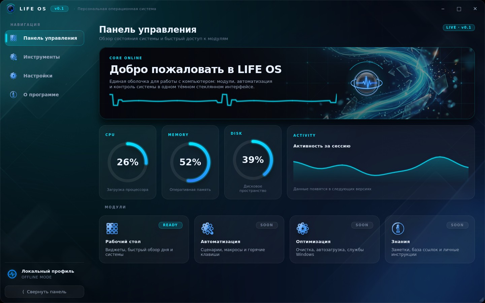

# LIFE OS · 0.1

**Персональная операционная система** — оболочка для упрощения работы с ПК.
Версия **0.1** — визуальный прототип: полностью готовый интерфейс (тёмный
glassmorphism + неон), собственная графика 4K, навигация, системный трей.
Функциональные модули подключаются в следующих релизах.



---

## Что уже есть

| Блок | Состояние |
|---|---|
| Безрамочное окно, свой титлбар, перетаскивание, resize за края | ✅ |
| Сайдбар с 4 разделами + сворачивание в иконочный режим | ✅ |
| Dashboard: hero-баннер, живая линия пульса, кольцевые индикаторы, спарк-график | ✅ |
| Инструменты: поиск, фильтр-чипы, сетка карточек модулей | ✅ |
| Настройки: смена акцента и фона на лету, переключатели, селекты | ✅ |
| О программе: hero, роадмап, стек | ✅ |
| Splash-экран загрузки с прогрессом | ✅ |
| Системный трей: меню, сворачивание в трей, уведомления | ✅ |
| Брендинг: логотип, мини-логотип, трей-иконка, `.ico`, 4K-фоны | ✅ |

## Скриншоты

| Инструменты | Настройки |
|---|---|
|  |  |

| О программе | Splash |
|---|---|
|  |  |

---

## Запуск

```bash
python -m venv .venv
# Windows
.venv\Scripts\activate
# Linux/macOS
source .venv/bin/activate

pip install -r requirements.txt
python main.py              # со splash-экраном
python main.py --no-splash  # сразу окно
```

Требуется Python 3.10+.

---

## Структура

```
main.py                  точка входа (QApplication, splash, окно)
lifeos/
  config.py              константы, версия, пути к ассетам
  theme.py               палитры акцентов + генератор QSS
  widgets.py             компоненты: стеклянные карточки, пульс, кольца,
                         спарк-график, фон-канвас, логотип-бейдж
  window.py              безрамочное окно: титлбар, сайдбар, трей, ресайз
  pages.py               4 экрана: Dashboard / Инструменты / Настройки / О программе
  splash.py              экран загрузки
tools/
  process_assets.py      хромакей, нарезка иконок, генерация размеров и .ico
  screenshot.py          оффскрин-рендер превью
assets/
  raw/                   исходные сгенерированные изображения (зелёный фон)
  logo/                  logo.png, logo_mini, logo_tray, orb, lifeos.ico + размеры
  icons/                 dashboard / tools / settings / about (плитки + глифы)
  backgrounds/           bg_main, bg_aurora (4K), splash, hero_card, about_art
docs/preview/            скриншоты интерфейса
```

## Графика

Все 10 изображений сгенерированы под проект. Логотипы и иконки рисовались
**на зелёном хромакее** и вырезаны скриптом `tools/process_assets.py`
(удаление зелени + despill + сглаживание альфы), поэтому вставляются в UI
без ореолов. Иконки дополнительно конвертируются в «чистые глифы» —
неоновая линия с прозрачностью по насыщенности, читаемая даже на 16 px.

Пересобрать ассеты после замены исходников:

```bash
python tools/process_assets.py
```

## Тема и акценты

Палитры лежат в `lifeos/theme.py`. Активны `cyan` и `electric`;
`violet`, `emerald`, `amber` уже описаны и помечены `available=False` —
включаются одним флагом в будущих версиях. Смена акцента перестраивает
QSS и перерисовывает все страницы на лету.

## Роадмап

- **0.1** — оболочка, брендинг, навигация *(готово)*
- **0.2** — мониторинг системы, быстрый запуск
- **0.3** — автоматизация: сценарии, макросы, горячие клавиши
- **0.4** — профили, синхронизация, резервные копии

---

© 2026 IstikFramer · Python 3 · PySide6 (Qt 6)
