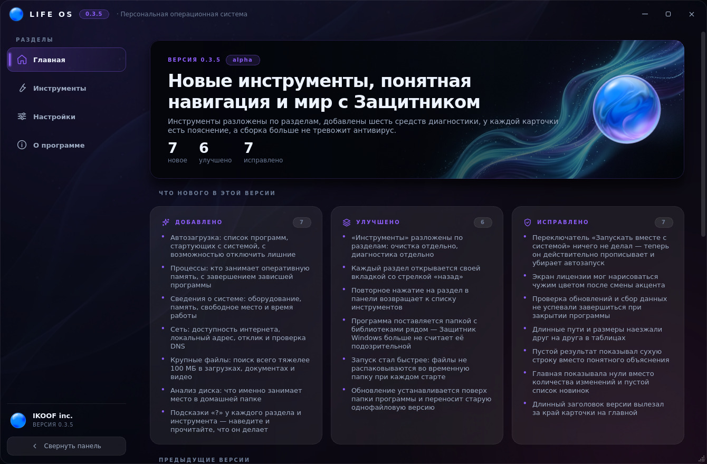
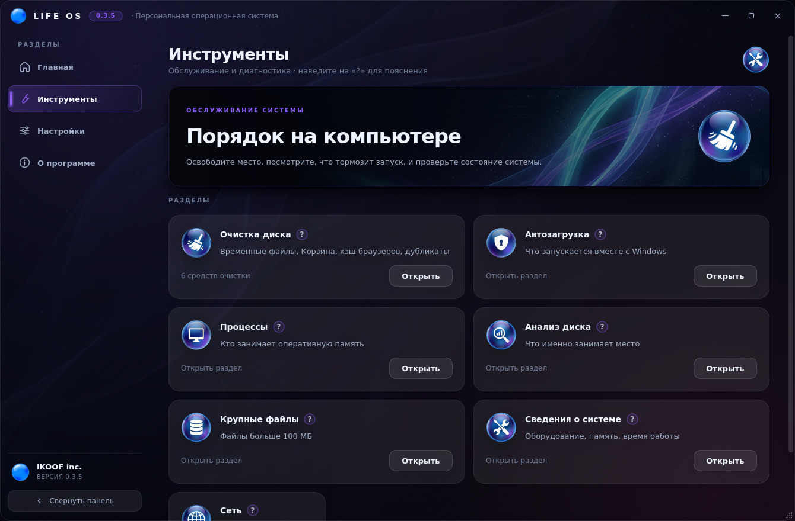
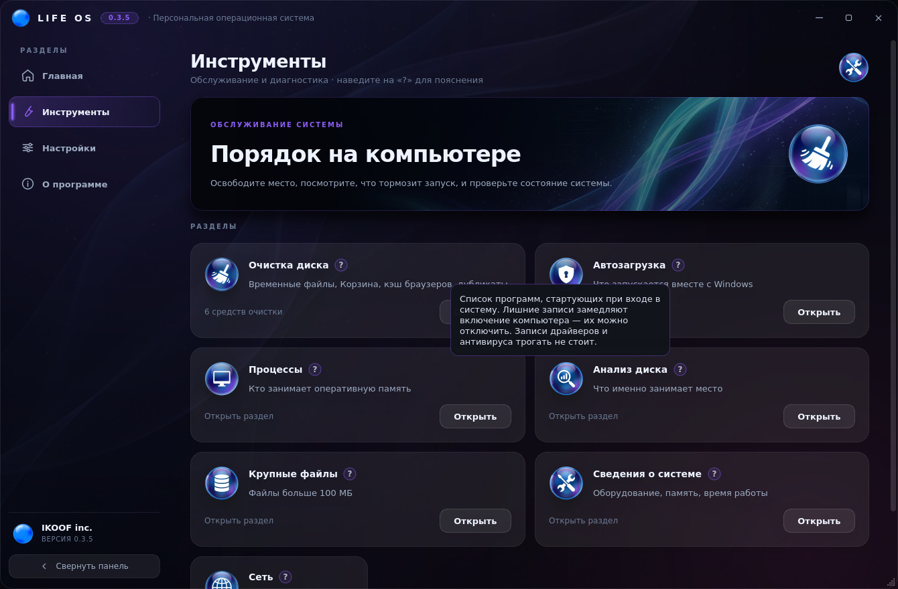
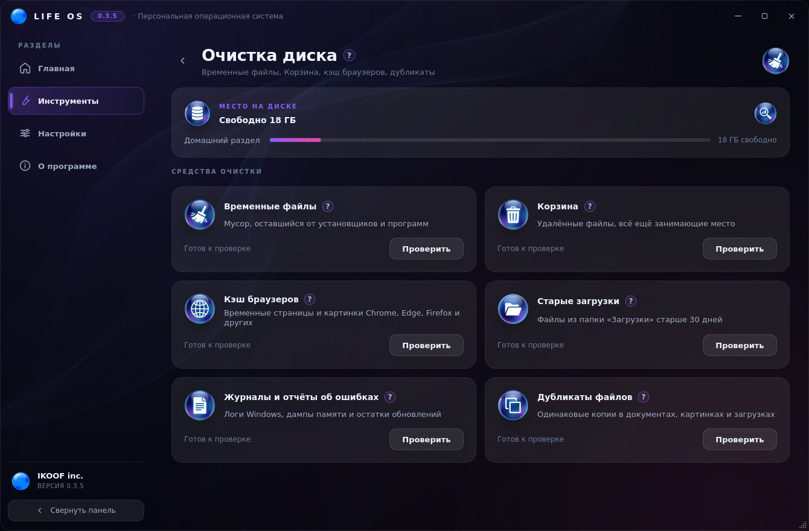
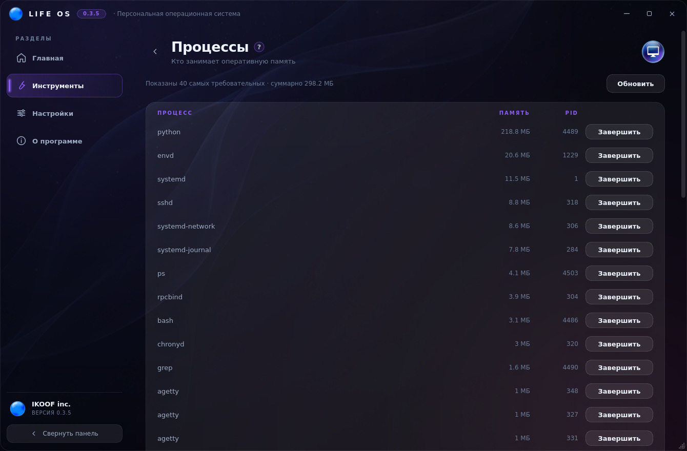
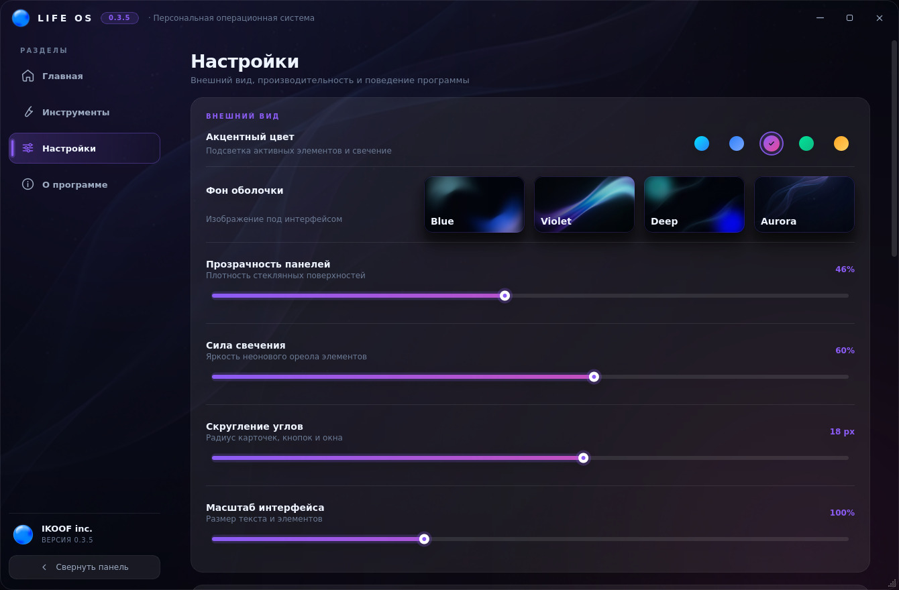
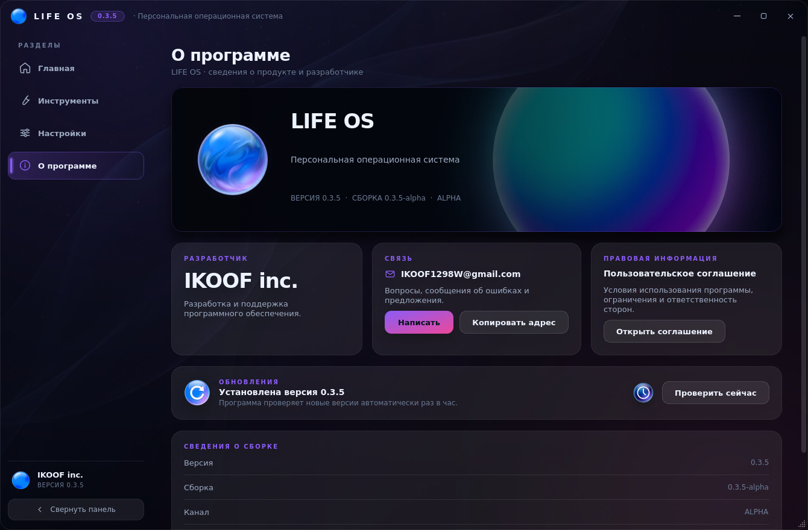
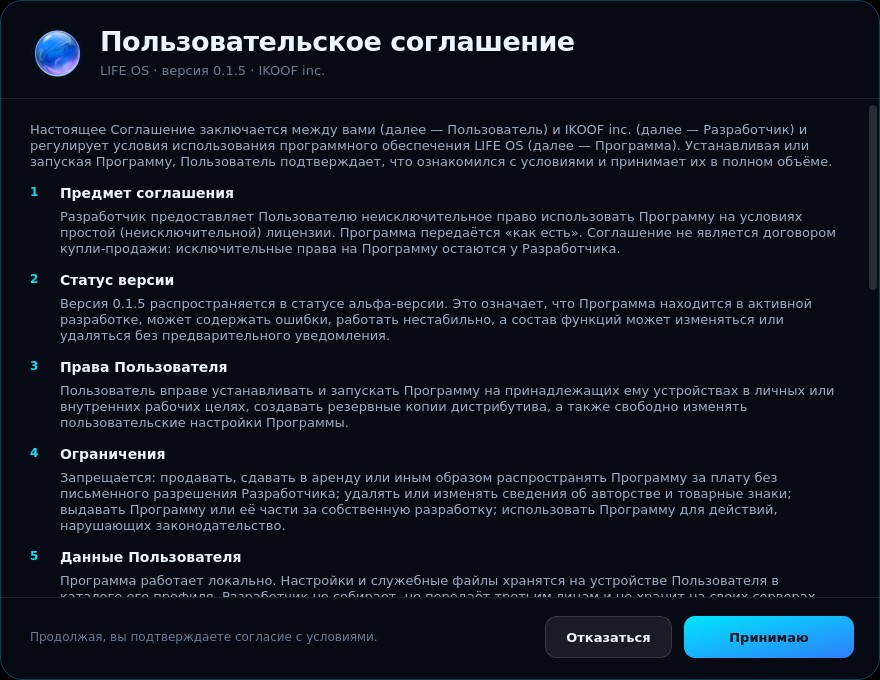
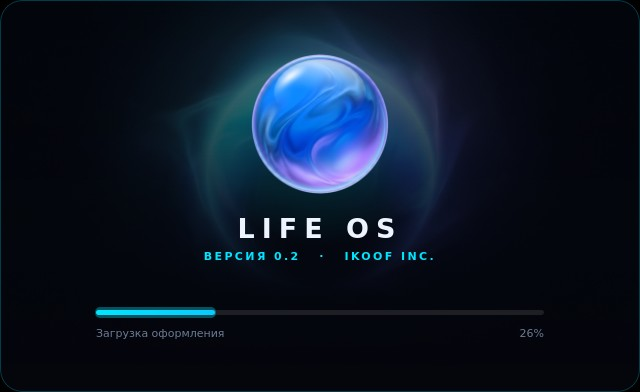

# LIFE OS

**Персональная операционная система** — оболочка для упрощения работы с ПК.
Разработчик: **IKOOF inc.** · [IKOOF1298W@gmail.com](mailto:IKOOF1298W@gmail.com)

Текущая версия — **0.3.5** (альфа).



---

## Что нового в 0.3.5

**Добавлено**
- Автозагрузка: что стартует вместе с системой, с отключением лишнего
- Процессы: кто занимает память, с завершением зависшей программы
- Сведения о системе и раздел «Сеть» с проверкой соединения
- Поиск файлов крупнее 100 МБ и анализ занятого места
- Подсказки «?» у каждого раздела и инструмента

**Улучшено**
- «Инструменты» разложены по разделам, каждый открывается своей вкладкой
- Программа поставляется папкой — Защитник Windows больше не срабатывает ложно
- Запуск стал быстрее: файлы не распаковываются во временную папку

**Исправлено**
- Переключатель «Запускать вместе с системой» теперь действительно работает
- Экран лицензии мог нарисоваться чужим цветом после смены акцента
- Фоновые задачи не успевали завершиться при закрытии программы
- Главная показывала нули вместо количества изменений в версии

## Экраны

| Инструменты | Подсказка «?» |
|---|---|
|  |  |

| Очистка диска | Процессы |
|---|---|
|  |  |

| Настройки | О программе |
|---|---|
|  |  |

| Соглашение | Загрузка |
|---|---|
|  |  |

---

## Запуск

```bash
python -m venv .venv
# Windows
.venv\Scripts\activate
# Linux / macOS
source .venv/bin/activate

pip install -r requirements.txt
python main.py              # обычный запуск
python main.py --no-splash  # без экрана загрузки
```

Требуется Python 3.10 или новее.

---

## Установка (Windows)

Готовая сборка не требует Python. Скачайте `LIFE-OS-0.3.5-windows.zip` со
страницы релизов, распакуйте папку целиком (например, в «Документы» или
`C:\Program Files`) и запустите `LIFE OS.exe` изнутри неё.

Программа поставляется папкой, а не одним файлом, намеренно: однофайловые
сборки распаковывают себя во временный каталог при каждом запуске, и
Защитник Windows принимает это за поведение вредоносной программы. Обычная
раскладка не вызывает ложных срабатываний и запускается быстрее.

Собирается автоматически на Windows через GitHub Actions
(`.github/workflows/build.yml`), локально — командой:

```
pyinstaller lifeos.spec --noconfirm
```

### Права администратора

Программа запускается от обычного пользователя. Часть системного мусора
(`Windows\Temp`, `Prefetch`, дампы памяти) доступна только администратору:
в этом случае показывается уведомление и кнопка «Перезапустить от админа»,
которая вызывает штатный запрос UAC. Очистка никогда не записывает в отчёт
файлы, которые удалить не удалось.

## Инструменты

Раздел разложен по категориям: на первом экране крупные кнопки, каждая
открывает свою вкладку со стрелкой «назад». У любого раздела есть значок
«?» — наведите, чтобы прочитать, что он делает.

### Очистка диска

Шесть средств, освобождающих место. Каждое работает в две фазы: сначала
**сканирование** (ничего не меняется), затем — по вашей команде — удаление.

| Инструмент | Что ищет |
|---|---|
| Временные файлы | `%TEMP%`, `Windows\Temp`, `Prefetch`, кэш загрузок |
| Корзина | содержимое `$Recycle.Bin` на всех дисках |
| Кэш браузеров | Chrome, Edge, Firefox, Яндекс, Opera, Brave |
| Старые загрузки | файлы из «Загрузок» старше 30 дней (по умолчанию не отмечены) |
| Журналы и отчёты | логи Windows, дампы памяти, остатки обновлений |
| Дубликаты файлов | одинаковые копии крупнее 1 МБ; самая старая копия сохраняется |

### Диагностика

| Раздел | Что показывает | Что можно сделать |
|---|---|---|
| Автозагрузка | программы, стартующие с системой | отключить лишние |
| Процессы | кто занимает оперативную память | завершить зависшую программу |
| Анализ диска | содержимое домашней папки по размеру | только просмотр |
| Крупные файлы | всё тяжелее 100 МБ | только просмотр |
| Сведения о системе | оборудование, память, время работы | только просмотр |
| Сеть | соединение, адрес, отклик, DNS | только просмотр |

Изменяющие действия — отключение автозагрузки и завершение процесса —
выполняются только после подтверждения.

Приоритет — Windows. На Linux и macOS инструменты используют системные аналоги
путей, а недоступные сообщают об этом и не выполняются.

## Обновления

Программа обновляется прямо из этого репозитория.

| Что | Как устроено |
|---|---|
| Источник | GitHub Releases, а если релизов нет — `data/version.json` в рабочей ветке |
| Доступ | GitHub Contents API (работает там, где `raw.githubusercontent.com` закрыт), с запасным raw-каналом |
| Автопроверка | через 4 секунды после запуска, далее раз в час |
| Подтверждение | установка только после нажатия «Установить» — молча ничего не ставится |
| Уведомления | плашка на главной, значок в заголовке окна и нативное уведомление Windows из области трея |
| Вес обновления | релизный архив собирается `tools/make_release.py` без `assets/raw` и `docs` — 13 МБ вместо 36 |
| Установка | загрузка архива с прогрессом → распаковка → резервная копия в `~/.lifeos/backups` → замена файлов → перезапуск |
| Откат | хранятся 3 последние резервные копии; `.git`, `.venv` и пользовательские данные не трогаются |

Чтобы выпустить новую версию: поднимите `APP_VERSION` в `lifeos/config.py`,
добавьте релиз в `data/changelog.json` и обновите `data/version.json`.

## Структура

```
main.py                 точка входа
lifeos/
  config.py             версия, реквизиты разработчика, пути
  anim.py               единый движок анимаций (тактовый генератор, Spring)
  settings.py           хранилище настроек с автосохранением
  theme.py              палитры акцентов и генератор QSS
  icons.py              векторные иконки (SVG → QIcon любого цвета и размера)
  widgets.py            слайдеры, переключатели, карточки, фон, орб, индикаторы
  pages.py              экраны: Главная, Настройки, О программе
  eula.py               окно пользовательского соглашения
  splash.py             экран загрузки
  window.py             главное окно, боковая панель, трей
data/
  changelog.json        список изменений (редактируется без правки кода)
  eula.json             текст пользовательского соглашения
tools/
  process_assets.py     обработка графики (хромакей, размеры, .ico)
  screenshot.py         рендер превью экранов
assets/
  raw/                  исходные изображения на зелёном фоне
  logo/                 логотип, мини-логотип, иконка трея, lifeos.ico
  backgrounds/          фоны 4K, экран загрузки, hero-арты
docs/preview/           скриншоты
```

---

## Как всё устроено

### Анимации

Раньше каждый анимированный элемент держал собственный таймер со своей
частотой — они конфликтовали, и интерфейс шёл рывками. Теперь в
`lifeos/anim.py` работает один тактовый генератор на всё приложение:

- виджеты подписываются на кадр, без подписчиков таймер останавливается;
- каждому кадру передаётся `dt` в секундах, поэтому скорость движения
  не зависит от нагрузки;
- частота ограничивается настройкой (30 / 60 / 120);
- при отключении анимаций такты просто перестают идти — процессор свободен;
- значения сглаживаются классом `Spring`, без дёрганий и «ступенек».

Фон окна кэширует статичную часть в пиксмап и обновляет блики ~20 раз
в секунду — полноэкранная перерисовка больше не забирает кадры
у интерактивных элементов.

### Настройки

Все параметры хранятся в `~/.lifeos/settings.json` и применяются мгновенно:
акцентный цвет, фон, прозрачность панелей, сила свечения, радиус скруглений,
масштаб интерфейса, скорость анимаций, лимит кадров, поведение трея.
Кнопка «Сбросить» возвращает значения по умолчанию.

### Графика

Логотипы рисовались на зелёном хромакее и вырезаны скриптом
`tools/process_assets.py` (удаление зелени, despill, сглаживание альфы).
Интерфейсные иконки — векторные, задаются в `lifeos/icons.py` и
перекрашиваются под текущий акцент.

Пересобрать графику после замены исходников:

```bash
python tools/process_assets.py
```

### Изменяемые тексты

Список изменений на главном экране берётся из `data/changelog.json`,
текст соглашения — из `data/eula.json`. Оба файла можно править
без изменения кода.

---

© 2026 IKOOF inc. Все права защищены.
